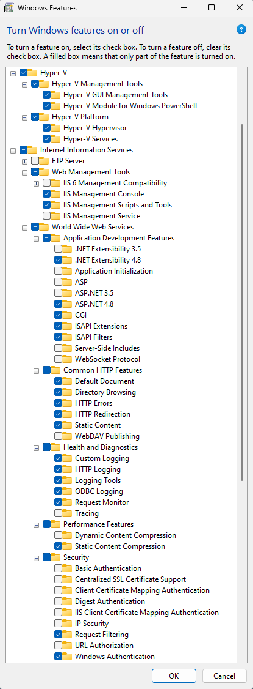

# Welcome to the ITD Software Section

## How to Setup your PC
For building our web applications we use IIS, PHP, and MySQL. We usually do our development on our PCs first, so the following will help you get started on setting up your PC.
### Git SCM
1. Download and install the latest 64-bit version of <a href="https://git-scm.com">Git</a> for Windows.
2. As you go through the installation wizard select what you want but I usually stick to the defaults.
3. Create a directory on your C: drive for your code. I call mine **websites**, but you may call yours something else.
4. Open the **Git Bash** terminal.
5. Change to your newly created **websites** directory by typing the following command and press **Enter**.
   - `cd /c/websites`
6. Type the following command to see if you have access to the following shared folder.
   - `ls //hpdrepos/git`
7. If you are not able to access this folder, please let me know. But if you are able to see a list of directories/files go to the next step.
8. Type the following command to clone this WelcomeOnBoard project.
   - `git clone //hpdrepos/git/WelcomeOnBoard.git`
9. This will create a folder called WelcomeOnBoard in your **websites** directory. There is a copy of this `README.md` file in the project folder.

### Install Hyper-V and IIS on Windows
1. Navigate to **Control Panel > Programs > Programs and Features > Turn Windows features on or off**.
2. Expand the **Hyper-V** and **Internet Information Services** nodes and make sure the following features are selected.

3. Click **OK** to install the selected features.  You may be asked to restart your computer.

### Install PHP
1. Navigate to the following [website](https://learn.microsoft.com/en-us/iis/application-frameworks/scenario-build-a-php-website-on-iis/configuring-step-1-install-iis-and-php)
2. Follow the instructions in section **1.2 Download and Install PHP Manually**, but **skip steps 2 & 4**
3. After step 18, do the next section called **To test your PHP installation**.
4. If you are unsure how to configure your php.ini file you can copy the following [php.ini](assets/files/php.ini) file to your C:\php folder.

### Install MySQL
1. Navigate to the following [website](https://dev.mysql.com/downloads/mysql/)
2. Download and install the latest 64-bit version of MySQL. I installed version 8.1.0.
3. I normally accept the defaults and I keep the root password as blank, but you may use your own password if you want.

### Install MySQL Workbench
1. Navigate to the following [website](https://dev.mysql.com/downloads/workbench/)
2. Download and install the latest 64-bit version of MySQL Workbench.
3. As I go through the installer I usually accept the defaults.

### Install Visual Studio Code (VS Code)
1. Download and install the latest stable build of the 64-bit version of [Visual Studio Code](https://code.visualstudio.com).
2. As I go through the installer I usually accept the defaults.

### Install the PHP Intelephense Extension
1. Open VS Code
2. Open the Extensions manager; either use the shortcut `ctrl-shift-x` or go to **File > Preferences > Extensions**.
3. In the **Search Extensions in Marketplace** search box type **PHP Intelephense** and install it.
4. After installing the extension you can close the extension manager.
5. to **File > Preferences > Settings** and in the **Search settings** input box type and press the **Enter** key.
6. In the results you should see a setting for **Editor: Format On Save** click the checkbox next to this setting to enable it.
7. Feel free to install any other extensions.

### Install Microsoft SQL Server Management Studio
Besides MySQL databases we also have Microsoft SQL Server databases that we may need to query for data so this is a good tool to have on hand.
1. Navigate the the following [website](https://learn.microsoft.com/en-us/sql/ssms/download-sql-server-management-studio-ssms?view=sql-server-ver16)
2. Click on the link **[Free Download for SQL Server Management Studio (SSMS) 19.1](https://aka.ms/ssmsfullsetup)**
3. Install SQL Server Management Studio.
4. As I go through the installer I usually accept the defaults.

### Coding Style Guide
1. For coding style guides please look at the [PHP Framework Interop Group (PHP-FIG)](https://www.php-fig.org/) website. 
2. Follow the coding style outlined in PSR-1 and PRS-12
3. Use camelCase for variableNames, propertyNames, functionNames, and methodNames.
4. The Intellephense VS Code extension will help with formatting your code.

